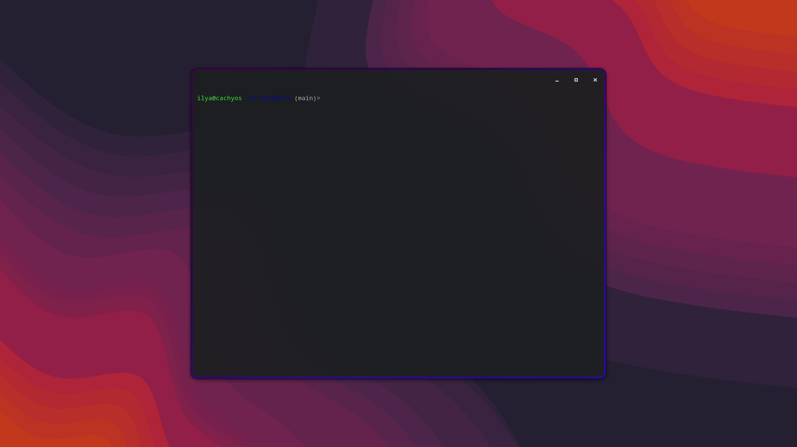

# TWMlike-term

Простой настраиваемый эмулятор терминала на Rust с использованием GTK4 и VTE4.
Копирует дизайн терминала в тайлинговых оконных менеджерах.

## Требования

### Ubuntu/Debian
```bash
sudo apt install libgtk-4-dev libvte-2.91-gtk4-dev build-essential
```

### Fedora
```bash
sudo dnf install gtk4-devel vte291-gtk4-devel
```

### Arch Linux
```bash
sudo pacman -S gtk4 vte4
```

## Сборка и установка

### Метод 1: Установка через Makefile (рекомендуется)

```bash
# Клонируйте репозиторий
git clone https://github.com/yourusername/terminal-emulator.git
cd terminal-emulator

# Проверка зависимостей и сборка
make

# Установка в систему (по умолчанию в /usr/local)
sudo make install

# Или установка в /usr
sudo make install PREFIX=/usr

# Удаление
sudo make uninstall

# Очистка собранных файлов
make clean

# Справка
make help
```

**Быстрая установка:**
```bash
# Автоматическая установка одной командой
./install.sh

# Или с указанием PREFIX
PREFIX=/usr ./install.sh
```

Makefile автоматически:
- Проверяет наличие Rust и всех необходимых библиотек
- Собирает оптимизированную версию (release)
- Устанавливает бинарник в `$PREFIX/bin/` (по умолчанию `/usr/local/bin/`)
- Устанавливает `.desktop` файл в `/usr/share/applications/` (всегда требует sudo)

**Важно**: Desktop файл всегда устанавливается в `/usr/share/applications/` независимо от значения PREFIX, поэтому установка требует прав суперпользователя (`sudo`).

**Доступные команды Makefile:**

| Команда | Описание |
|---------|----------|
| `make` | Проверить зависимости и собрать проект |
| `make build` | Собрать проект (release) |
| `make install` | Установить в систему |
| `make uninstall` | Удалить из системы |
| `make clean` | Очистить собранные файлы |
| `make check-deps` | Проверить наличие зависимостей |
| `make help` | Показать справку |

### Метод 2: Ручная сборка через Cargo

```bash
# Сборка проекта
cargo build --release

# Запуск
cargo run
```

## Запуск

После установки через Makefile:
```bash
# Из командной строки
terminal-emulator

# Или найдите "Terminal Emulator" в меню приложений вашего DE
```

## Возможности

- [x] Базовый эмулятор терминала
- [x] Запуск оболочки (bash/zsh/fish)
- [x] Настройка цвета фона через конфигурационный файл
- [x] Настройка размера окна
- [x] Настройка прозрачности окна
- [x] Выбор стиля заголовка (стандартный или монолитный)
- [x] Автоматическое закрытие окна при выходе из терминала (Ctrl+D)
- [x] Настраиваемая обводка окна (толщина и цвет)
- [x] Градиентная обводка окна
- [x] Скругление углов окна
- [x] Внутренние отступы (padding)
- [ ] Настройка шрифтов
- [ ] Горячие клавиши
- [ ] Вкладки
- [ ] Разделение окон
- [X] Полная цветовая схема (16 цветов)

## Конфигурация

Терминал поддерживает настройку через конфигурационный файл в формате TOML.

### Расположение файла конфигурации

Linux: `~/.config/terminal-emulator/config.toml`

### Создание конфигурации

Скопируйте пример конфигурации:
```bash
mkdir -p ~/.config/terminal-emulator
cp config.toml.example ~/.config/terminal-emulator/config.toml
```

### Доступные настройки

#### Окно (`[window]`)
- `width` - ширина окна в пикселях (по умолчанию: 800)
- `height` - высота окна в пикселях (по умолчанию: 600)
- `opacity` - прозрачность от 0.0 до 1.0 (по умолчанию: 1.0)
- `headerbar_style` - стиль заголовка окна (по умолчанию: "standard")
  - `"standard"` - стандартный системный заголовок
  - `"integrated"` - монолитный заголовок того же цвета что и терминал
- `border_width` - толщина обводки окна в пикселях (по умолчанию: 0)
- `border_color` - цвет обводки в формате #RRGGBB или градиент (по умолчанию: #ffffff)
  - Обычный цвет: `"#00ff00"`
  - Градиент: `"linear_gradient to right #ff0000 #00ff00 #0000ff"`
- `border_radius` - скругление углов окна в пикселях (по умолчанию: 0)
- `padding` - внутренний отступ от края окна до текста в пикселях (по умолчанию: 0)

#### Терминал (`[terminal]`)
- `background_color` - цвет фона в формате #RRGGBB (по умолчанию: #1e1e1e)

### Пример конфигурации

```toml
[window]
width = 1024
height = 768
opacity = 0.95
headerbar_style = "integrated"  # монолитный заголовок
border_width = 3                # обводка 3 пикселя
border_color = "linear_gradient to right bottom #ff00ff #00ffff #00ff00"  # градиент
border_radius = 15              # скруглённые углы
padding = 10                    # внутренний отступ 10px

[terminal]
background_color = "#282c34"
```

### Особенности

**Автоматическое закрытие окна**: Окно терминала автоматически закрывается при выходе из оболочки (команда `exit` или Ctrl+D).

**Монолитный заголовок**: При выборе стиля `"integrated"` заголовок окна будет того же цвета что и фон терминала, создавая единый стиль интерфейса.

**Градиентная обводка**: Поддержка линейных градиентов для обводки окна. Формат: `"linear_gradient to [направление] #цвет1 #цвет2 #цвет3 ..."`.

✅ **Градиенты теперь полностью совместимы со скруглением углов!** Используется метод двойного `background` аналогичный браузерному CSS.

**Технические детали**: Для создания градиентной обводки со скруглёнными углами используется техника с двумя слоями `background`:
```css
background: linear-gradient(окно-цвет, окно-цвет) padding-box,
            linear-gradient(градиент) border-box;
border: Npx solid transparent;
border-radius: Mpx;
```
Этот метод работает в GTK CSS так же, как в современных браузерах.

Примеры градиентов:
- `"linear_gradient to right #ff0000 #0000ff"` - горизонтальный градиент от красного к синему
- `"linear_gradient to bottom #00ff00 #ffff00"` - вертикальный градиент от зелёного к жёлтому
- `"linear_gradient to right bottom #ff00ff #00ffff"` - диагональный градиент
- `"linear_gradient to right #ff0000 #ff7f00 #ffff00 #00ff00 #0000ff #8b00ff"` - радужный градиент

**Скругление углов**: Настраивается радиус скругления углов окна через параметр `border_radius`.

## Структура проекта

```
terminal-emulator/
├── Cargo.toml                  # Зависимости и настройки проекта
├── Makefile                    # Makefile для сборки и установки
├── install.sh                  # Скрипт быстрой установки
├── terminal-emulator.desktop   # Desktop файл для GUI запуска
├── config.toml.example         # Пример конфигурационного файла
├── src/
│   ├── main.rs                 # Основной код приложения
│   └── config.rs               # Модуль работы с конфигурацией
└── README.md                   # Этот файл
```

## Разработка

### Зависимости для разработки

Убедитесь, что у вас установлены:
- Rust (rustc + cargo): https://rustup.rs/
- GTK4: `libgtk-4-dev`
- VTE4: `libvte-2.91-gtk4-dev`

### Проверка зависимостей

```bash
make check-deps
```

### Сборка в режиме отладки

```bash
cargo build
cargo run
```

### Тестирование конфигурации

```bash
# Скопируйте пример конфигурации
mkdir -p ~/.config/terminal-emulator
cp config.toml.example ~/.config/terminal-emulator/config.toml

# Отредактируйте конфигурацию
nano ~/.config/terminal-emulator/config.toml

# Запустите терминал
cargo run
```
